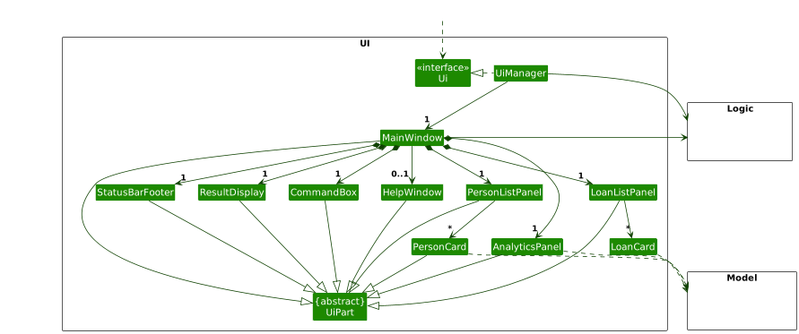
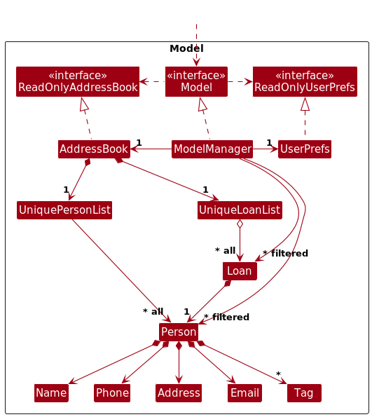
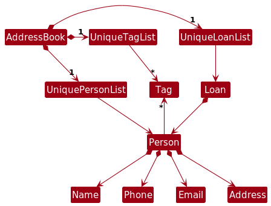
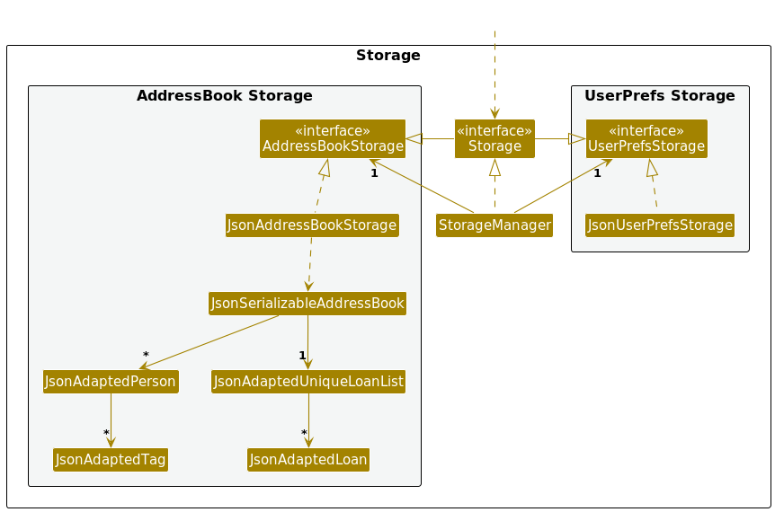
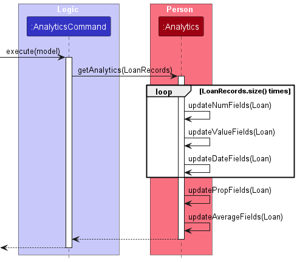
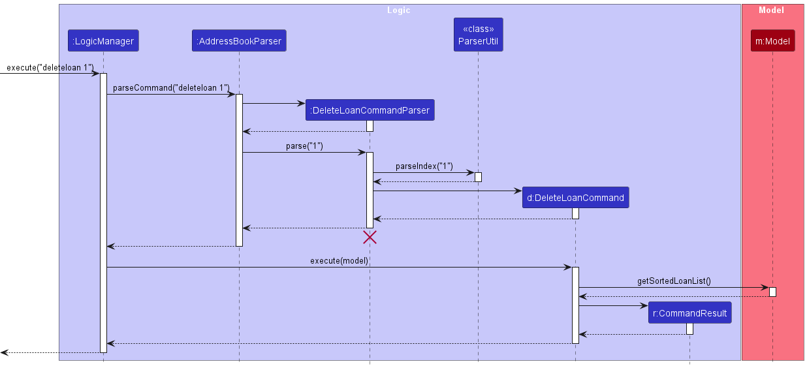
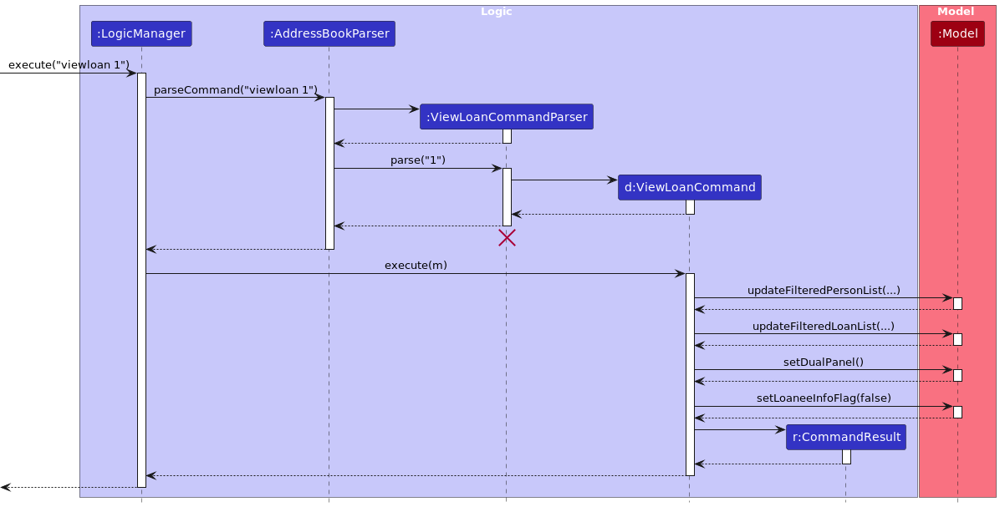
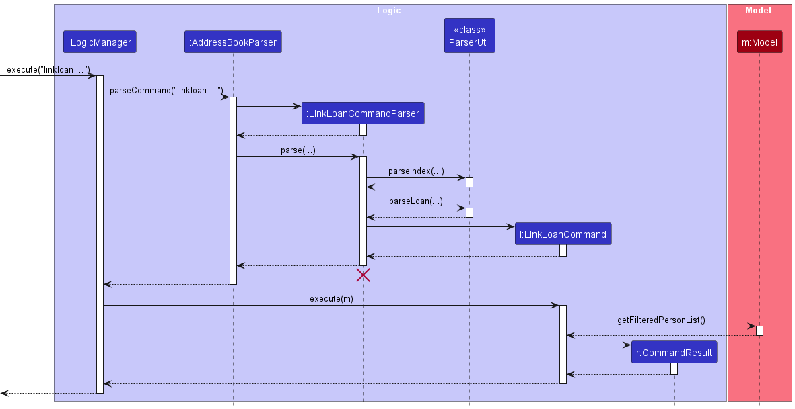

[//]: <> (comment, To-do, make working links)
[//]: <> (more To-dos: Instructions for Manual Testing, Appendix: Effort, Planned Enhancements)

## Table of Contents
[1. Acknowledgements](#acknowledgements) 
[2. Setting up, getting started](#setting-up-getting-started) 
[3. Design](#design) 
- [3.1 Architecture](#architecture) 
- [3.2 UI component](#ui-component) 
- [3.3 Logic component](#logic-component) 
- [3.4 Model component](#model-component) 
- [3.5 Storage component](#storage-component) 
- [3.6 Common classes](#common-classes) 

[4. Enhancements Added](#enhancements-added) 
- [4.1 Loan Analytics - Joseph](#loan-analytics---joseph) 
- [4.2 Delete Loan - Xiaorui](#delete-loan---xiaorui) 
- [4.3 Loan view command - Wang Junwu](#loan-view-command---wang-junwu) 
- [4.4 Loan view GUI - Kyal Sin Min Thet](#loan-view-gui---kyal-sin-min-thet) 
- [4.5 Linking a loan - Khor Jun Wei](#linking-a-loan---khor-jun-wei) 

[5. Documentation, logging, testing, configuration, dev-ops](#documentation-logging-testing-configuration-dev-ops) 
[6. Appendix: Requirements](#appendix-requirements) 

- [6.1 Product scope](#product-scope) 
- [6.2 User stories](#user-stories) 
- [6.3 Use cases](#use-cases) 
- [6.4 Non-Functional Requirements](#non-functional-requirements) 

[7. Appendix: Instructions for manual testing](#appendix-instructions-for-manual-testing) 
- [7.1 Launch and shutdown](#launch-and-shutdown) 
- [7.2 Deleting a person](#deleting-a-person) 
- [7.3 Linking a loan](#linking-a-loan) 
- [7.4 Viewing loans](#viewing-loans) 
- [7.5 Marking and unmarking a loan](#marking-and-unmarking-a-loan) 
- [7.6 Editing a loan](#editing-a-loan) 
- [7.7 Deleting a loan](#deleting-a-loan) 
- [7.8 Analytics Command](#analytics-command) 
- [7.9 Saving data](#saving-data) 
- [7.10 Exiting the app](#exiting-the-app) 

[8. Appendix: Effort](#appendix-effort) 
[9. Glossary](#glossary) 

--------------------------------------------------------------------------------------------------------------------

## **Acknowledgements**

This project is modified upon the [AddressBook-Level3 project](https://github.com/se-edu/addressbook-level3) project created by the SE-EDU initiative,
as well as the [tutorials](https://nus-cs2103-ay2021s1.github.io/tp/tutorials/AddRemark.html) and guides provided.

--------------------------------------------------------------------------------------------------------------------

## **Setting up, getting started**

Refer to the guide [_Setting up and getting started_](SettingUp.md).

--------------------------------------------------------------------------------------------------------------------

## **Design**

:bulb: **Tip:** The `.puml` files used to create diagrams in this document `docs/diagrams` folder. Refer to the [
_PlantUML Tutorial_ at se-edu/guides](https://se-education.org/guides/tutorials/plantUml.html) to learn how to create
and edit diagrams.

### Architecture

The ***Architecture Diagram*** given above explains the high-level design of the App.

Given below is a quick overview of main components and how they interact with each other.

**Main components of the architecture**

**`Main`** (consisting of
classes [`Main`](https://github.com/AY2324S2-CS2103T-W13-1/tp/tree/master/src/main/java/seedu/address/Main.java)
and [`MainApp`](https://github.com/AY2324S2-CS2103T-W13-1/tp/tree/master/src/main/java/seedu/address/MainApp.java)) is
in charge of the app launch and shut down.

* At app launch, it initializes the other components in the correct sequence, and connects them up with each other.
* At shut down, it shuts down the other components and invokes cleanup methods where necessary.

The bulk of the app's work is done by the following four components:

* [**`UI`**](#ui-component): The UI of the App.
* [**`Logic`**](#logic-component): The command executor.
* [**`Model`**](#model-component): Holds the data of the App in memory.
* [**`Storage`**](#storage-component): Reads data from, and writes data to, the hard disk.

[**`Commons`**](#common-classes) represents a collection of classes used by multiple other components.

**How the architecture components interact with each other**

The *Sequence Diagram* below shows how the components interact with each other for the scenario where the user issues
the command `delete 1`.

Each of the four main components (also shown in the diagram above),

* defines its *API* in an `interface` with the same name as the Component.
* implements its functionality using a concrete `{Component Name}Manager` class (which follows the corresponding
  API `interface` mentioned in the previous point.

For example, the `Logic` component defines its API in the `Logic.java` interface and implements its functionality using
the `LogicManager.java` class which follows the `Logic` interface. Other components interact with a given component
through its interface rather than the concrete class (reason: to prevent outside component's being coupled to the
implementation of a component), as illustrated in the (partial) class diagram below.

The sections below give more details of each component.

### UI component

The **API** of this component is specified
in [`Ui.java`](https://github.com/AY2324S2-CS2103T-W13-1/tp/tree/master/src/main/java/seedu/address/ui/Ui.java)

The UI consists of a `MainWindow` that has three different views. Each view consists of parts which
inherit from the abstract `UiPart` class which captures the commonalities between classes that represent parts of the
visible GUI.
1. The **person tab view** is made up of four parts:
`CommandBox`, `ResultDisplay`, `PersonListPanel`, `StatusBarFooter`.
2. The **loan tab view** is made up of four parts:
`CommandBox`, `ResultDisplay`, `LoanListPanel`, `StatusBarFooter`.
3. The **analytics tab view** is made up of four parts:
`CommandBox`, `ResultDisplay`, `AnalyticsPanel`, `StatusBarFooter`.

The `UI` component uses the JavaFx UI framework. The layout of these UI parts are defined in matching `.fxml` files that
are in the `src/main/resources/view` folder. For example, the layout of
the [`MainWindow`](https://github.com/AY2324S2-CS2103T-W13-1/tp/tree/master/src/main/java/seedu/address/ui/MainWindow.java)
is specified
in [`MainWindow.fxml`](https://github.com/AY2324S2-CS2103T-W13-1/tp/tree/master/src/main/resources/view/MainWindow.fxml)

The `UI` component,

* executes user commands using the `Logic` component, which could switch between the different views.
* listens for changes to `Model` data so that the UI can be updated with the modified data.
* keeps a reference to the `Logic` component, because the `UI` relies on the `Logic` to execute commands.
* depends on some classes in the `Model` component,
as it displays `Person`, `Loan` and `Analytics` object residing in the `Model`.

### Logic component

**API** : [`Logic.java`](https://github.com/AY2324S2-CS2103T-W13-1/tp/tree/master/src/main/java/seedu/address/logic/Logic.java)

Here's a (partial) class diagram of the `Logic` component:

The sequence diagram below illustrates the interactions within the `Logic` component, taking `execute("delete 1")` API
call as an example.

:information_source: **Note:** The lifeline for `DeleteCommandParser` should end at the destroy marker (X) but due to a limitation of PlantUML, the lifeline continues till the end of diagram.

How the `Logic` component works:

1. When `Logic` is called upon to execute a command, it is passed to an `AddressBookParser` object which in turn creates
   a parser that matches the command (e.g., `DeleteCommandParser`) and uses it to parse the command.
1. This results in a `Command` object (more precisely, an object of one of its subclasses e.g., `DeleteCommand`) which
   is executed by the `LogicManager`.
1. The command can communicate with the `Model` when it is executed (e.g. to delete a person). 
   Note that although this is shown as a single step in the diagram above (for simplicity), in the code it can take
   several interactions (between the command object and the `Model`) to achieve.
1. The result of the command execution is encapsulated as a `CommandResult` object which is returned back from `Logic`.

Here are the other classes in `Logic` (omitted from the class diagram above) that are used for parsing a user command:

How the parsing works:

* When called upon to parse a user command, the `AddressBookParser` class creates an `XYZCommandParser` (`XYZ` is a
  placeholder for the specific command name e.g., `AddCommandParser`) which uses the other classes shown above to parse
  the user command and create a `XYZCommand` object (e.g., `AddCommand`) which the `AddressBookParser` returns back as
  a `Command` object.
* All `XYZCommandParser` classes (e.g., `AddCommandParser`, `DeleteCommandParser`, ...) inherit from the `Parser`
  interface so that they can be treated similarly where possible e.g, during testing.

### Model component

**API** : [`Model.java`](https://github.com/AY2324S2-CS2103T-W13-1/tp/tree/master/src/main/java/seedu/address/model/Model.java)

The `Model` component,

* stores the address book data i.e., all `Person` objects (which are contained in a `UniquePersonList` object).
* stores the loan records data i.e., all `Loan` objects (which are contained in a `UniqueLoanList` object).
* stores the currently 'selected' `Person` objects (e.g., results of a search query) as a separate _filtered_ list which
  is exposed to outsiders as an unmodifiable `ObservableList<Person>` that can be 'observed' e.g. the UI can be bound to
  this list so that the UI automatically updates when the data in the list change.
* stores the currently 'selected' `Loan` objects (e.g., results of a view loan command) as a separate
  _filtered_ and _sorted_ list which
  is exposed to outsiders as an unmodifiable `ObservableList<Loan>` that can be 'observed' e.g. the UI can be bound to
  this list so that the UI automatically updates when the data in the list change.
* stores a `UserPref` object that represents the user’s preferences. This is exposed to the outside as
  a `ReadOnlyUserPref` objects.
* does not depend on any of the other three components (as the `Model` represents data entities of the domain, they
  should make sense on their own without depending on other components)

:information_source: **Note:** An alternative (arguably, a more OOP) model is given below. It has a `Tag` list in the `AddressBook`, which `Person` references. This allows `AddressBook` to only require one `Tag` object per unique tag, instead of each `Person` needing their own `Tag` objects. 

### Storage component

**API** : [`Storage.java`](https://github.com/AY2324S2-CS2103T-W13-1/tp/tree/master/src/main/java/seedu/address/storage/Storage.java)

The `Storage` component,

* can save both address book data and user preference data in JSON format, and read them back into corresponding
  objects.
* inherits from both `AddressBookStorage` and `UserPrefStorage`, which means it can be treated as either one (if only
  the functionality of only one is needed).
* depends on some classes in the `Model` component (because the `Storage` component's job is to save/retrieve objects
  that belong to the `Model`)

### Common classes

Classes used by multiple components are in the `seedu.addressbook.commons` package.

## Enhancements Added

[//]: <> (change it to the analytics function)

### Loan Analytics - Joseph

#### Implementation

The `Analytics` class handles the analysis of a `ObservableList<Loan>` object.
This class can only be instantiated by calling the static method `getAnalytics(ObservableList<Loan> loanList)`.

It contains the following fields that can prove to be useful for the user:

* `numLoans`: total number of loans
* `numOverdueLoans`: total number of overdue loans
* `numActiveLoans`: total number of active loans
* `propOverdueLoans`: proportion of loans that are overdue over active loans
* `propActiveLoans`: proportion of loans that are active over total loans
* `totalValueLoaned`: total value of all loans
* `totalValueOverdue`: total value of all overdue loans
* `totalValueActive`: total value of all active loans
* `averageLoanValue`: average loan value of all loans
* `averageOverdueValue`: average loan value of all overdue loans
* `averageActiveValue`: average loan value of all active loans
* `earliestLoanDate`: earliest loan date of all loans
* `earliestReturnDate`: earliest return date of active loans
* `latestLoanDate`: latest loan date of all loans
* `latestReturnDate`: latest return date of active loans

The `AnalyticsCommand` class handles the viewing of analytics of any one person within the current contact list in view.
The following shows how the analytics class is used in the execution of a command to view the analytics of a person:

#### Design considerations:

##### Aspect: Initialization of the Analytics object:

* **Alternative 1 (current choice):** Initialize the Analytics class using a factory method.
    * Pros: Hide the constructor from the user, ensure that fields are initialized correctly, more defensive.
    * Cons: Slightly more complex than a public constructor.

* **Alternative 2:** Initialize the Analytics class using a public constructor.
    * Pros: More straightforward to use.
    * Cons: User may not initialize the fields correctly, less defensive.

##### Aspect: What fields to include in the analytics:

* **Alternative 1 (current choice):** Include all fields.
    * Pros: Satisfy 'ask, don't tell' principle.
    * Cons: Possibly result in redundant information for the GUI developer.

* **Alternative 2:** Include only raw data (e.g. total number of loans, total value of all loans).
    * Pros: No redundant information.
    * Cons: GUI developer has to calculate the analytics themselves, violating 'ask, don't tell' principle.

### Delete Loan - Xiaorui

#### Implementation

The `DeleteLoanCommand` class handles the deletion of a loan from the current contact in view, and executes the command
after the input is parsed and transformed into an appropriate format.
The parsing of the command is done by the `DeleteLoanCommandParser` class, which is responsible for parsing the user
input.

The `DeleteLoanCommand` class is instantiated in the `DeleteLoanCommandParser` class, while the
`DeleteLoanCommandParser` is instantiated in the `AddressBookParser` class. Both classes are instantiated when the user
enters a `deleteloan` command, which needs to be of the format `deleteloan INDEX`
where INDEX is the index of the loan to be deleted (which is a positive whole number).

The `DeleteLoanCommand` class contains the following fields which can prove to be useful for the user:

* `loanIndex`: the index of the loan to be deleted
* Several string fields that are displayed to the user under different scenarios.

The `DeleteLoanCommandParser` class does not contain any fields.

Sequence diagram for the deletion of a loan:

#### Design considerations:

##### Aspect: How the command is executed:

* **Alternative 1 (current choice):** The `DeleteLoanCommand` class is responsible for executing the command only.
    * Pros: Follows the Single Responsibility Principle. Simpler to debug.
    * Cons: May result in more classes.
* **Alternative 2:** The `LogicManager` class is responsible for executing the command.
    * Pros: More centralized command execution.
    * Cons: May result in the `LogicManager` class becoming too large. This also goes against various SWE principles,
      and makes the code harder to maintain.

##### Aspect: How the command is parsed:

* **Alternative 1 (current choice):** The `DeleteLoanCommandParser` class is responsible for parsing the command.
    * Pros: Follows the Single Responsibility Principle. Simpler to debug.
    * Cons: May result in more classes.
* **Alternative 2:** The `AddressBookParser` class is responsible for parsing the command.
    * Pros: More centralized command parsing.
    * Cons: May result in the `AddressBookParser` class becoming too large. This also goes against various SWE
      principles, and makes the code harder to maintain.

### Loan view command - Wang Junwu

#### Implementation

The `ViewLoanCommand` class handles the viewing of all loans attached to a contact, and executes the command after the
input is parsed and transformed into an appropriate format.
The parsing of the command is done by the `ViewLoanCommandParser` class,
which is responsible for parsing the user input.

The `ViewLoanCommand` class is instantiated in the `ViewLoanCommandParser` class, while the
`ViewLoanCommandParser` is instantiated in the `AddressBookParser` class. Both classes are instantiated when the user
enters a `viewloan` command, which needs to be of the format `viewloan INDEX`
where INDEX is the index of the person whose loans are to be viewed, a positive whole number.

The `ViewLoanCommand` class contains the following fields which can prove to be useful for the user:
* `targetIndex`: the index of the person whose loans are to be viewed
* Some string fields that are displayed to the user under different scenarios.

The `ViewLoanCommandParser` class does not contain any fields.

Sequence diagram for the viewing of loans:

#### Design considerations:

##### Aspect: How the loan list is accessed:

* **Alternative 1 (current choice):** The `ViewLoanCommand.execute()` method sequentially obtains the person list,
the person, and then the loan list.
    * Pros: Minimises the layers of methods to follow through.
    * Cons: May violate the SLAP principle and the Law of Demeter.
* **Alternative 2:** The `ViewLoanCommand.execute()` method obtains the loan list directly from the `Model`.
    * Pros: Follows the SLAP principle and the Law of Demeter. Better use of abstraction.
    * Cons: May result in longer method chains.

##### Aspect: How the command is parsed:

* **Alternative 1 (current choice):** The `ViewLoanCommandParser` class is responsible for parsing the command.
    * Pros: Follows the Single Responsibility Principle. Simpler to debug.
    * Cons: May result in more classes.
* **Alternative 2:** The `AddressBookParser` class is responsible for parsing the command.
    * Pros: More centralized command parsing.
    * Cons: May result in the `AddressBookParser` class becoming too large. This also goes against various SWE
      principles
      ,and makes the code harder to maintain.

### Loan view GUI - Kyal Sin Min Thet

#### Implementation

The GUI component to display loans attached to a contact is implemented in tandem with the `viewloan` command.

The update behaviour is achieved through the use of `ObservableList` objects in the `Model` component. The `MainWindow`
component listens for changes in the `ObservableList` objects and updates the GUI accordingly.

The `LoanListPanel` (similar to `PersonListPanel`) is responsible for displaying the list of loans attached to a
contact. It generates new `LoanCard` objects according to the `loanList` in the `Model` class.
To accommodate the new GUI component, the `MainWindow.java` file is updated to include the new `LoanListPanel`.

To ensure that only either the loan list or the person list is displayed, an additional `BooleanProperty` is added to
the `Model`
component to act as a flag to indicate which list is currently being displayed. This flag is updated by corresponding
commands.
For instance, commands such as `list` will toggle the flag to false, while `viewloan` will toggle the flag to true.
This update switches the display between the two lists inside `MainWindow`.

#### Design Considerations

##### Aspect: How the GUI is updated

* **Alternative 1 (current choice):** The GUI updates are done by the `Model` component's observable properties.
    * Pros: Follows the observer design pattern, reducing coupling between the `Model` and `MainWindow` components.
    * Cons: The GUI updates are restricted to the observable properties of the `Model` component.

* **Alternative 2:** The GUI updates are done by the `MainWindow` component.
    * Pros: More explicit control over the GUI updates.
    * Cons: `Model` needs a reference to `MainWindow` to update the GUI directly. This increases coupling between the
      components.

### Linking a loan - Khor Jun Wei

#### Implementation

Linking a loan is implemented through the `linkloan` command, which adds a loan to the list. This was achieved through
the addition of a `LinkLoanCommand` class, which handles the retrieval of targets (the target loan and person)
and the execution of the command.

The `LinkLoanCommand` class is instantiated in the `LinkLoanCommandParser` class, while the
`LinkLoanCommandParser` is instantiated in the `AddressBookParser` class. Both classes are instantiated when the user
enters a `linkloan` command, which needs to be of the format `linkloan INDEX v/VALUE s/START_DATE r/RETURN_DATE`
where INDEX (a positive whole number) is the index of the person, VALUE (a positive decimal number) is the value of the loan,
and START_DATE and RETURN_DATE (both dates in the format yyyy-mm-dd) are the start and return dates of the loan respectively.

The `LinkLoanCommand` class contains the following fields which can prove to be useful for the user:

* `toLink`: the description of the loan to be linked as a `LinkLoanDescriptor`, including its value, start date and return date
* `linkTarget`: the index of the person to link the loan to
* Several string fields that are displayed to the user under different scenarios.

Sequence diagram for the linking of loans:

#### Design Considerations

##### Aspect: How the command is executed:

* **Alternative 1 (current choice):** The `LinkLoanCommand` class is responsible for executing the command only.
    * Pros: Follows the Single Responsibility Principle. Simpler to debug.
    * Cons: May result in more classes.
* **Alternative 2:** The `LogicManager` class is responsible for executing the command.
    * Pros: More centralized command execution.
    * Cons: May result in the `LogicManager` class becoming too large. This also goes against various SWE principles,
      and makes the code harder to maintain.

##### Aspect: How the command parameters (i.e. loan details) are stored:

* **Alternative 1 (current choice):** The parameters are stored in a temporary `LinkLoanDescriptor`,
which is then passed into the `LinkLoanCommand`.
    * Pros: As it follows the style of the `EditCommand`, it is simpler to debug. In addition, it follows the Single Responsibility Principle
  as then the `LinkLoanDescriptor` will be in charge of handling the loan details.
  * Cons: An additional `LinkLoanDescriptor` nested class is needed in `LinkLoanCommand`.
* **Alternative 2:** Each detail about the loan (e.g. value, start date) is stored
separately in the `LinkLoanCommand`.
    * Pros: Eliminates the need for any additional classes.
    * Cons: Reduces the ease for potentially adding new loan details in the future,
  as then each time a new field would need to be added to `LinkLoanCommand`. In addition,
  may be more difficult to debug due to novelty of code.

--------------------------------------------------------------------------------------------------------------------

## **Documentation, logging, testing, configuration, dev-ops**

* [Documentation guide](Documentation.md)
* [Testing guide](Testing.md)
* [Logging guide](Logging.md)
* [Configuration guide](Configuration.md)
* [DevOps guide](DevOps.md)

--------------------------------------------------------------------------------------------------------------------

## **Appendix: Requirements**

### Product scope

**Target user profile**:

The target user is a business person who satisfies the following criteria:

* has a need to manage a significant number of contacts;
* prefers desktop apps over other types of apps;
* can type fast;
* prefers typing to mouse interactions;
* is reasonably comfortable using CLI apps;
* wants to manage contacts faster than a typical mouse/GUI driven app.

Typically, they want to answer the following questions quickly:

* How much cash was loaned?
* To whom it was loaned to?
* When the person is due to return the loan?
* When did the person last loan?

**Value proposition**: Manage contacts faster than a typical mouse/GUI driven app

Our software streamlines loanee management, preventing profit loss and enhancing loanee engagement.
It simplifies loan categorization and tracks product quality post-return, ensuring efficient
decision-making. Some boundaries include no detailed client reviews or personal loan management,
as we focus solely on business loans and contact management for a select client group.

### User stories

Priorities: High (must have) - `* * *`, Medium (nice to have) - `* *`, Low (unlikely to have) - `*`

| Priority | As a …​                                           | I want to …​                                            | So that I can…​                                                         |
|----------|---------------------------------------------------|---------------------------------------------------------|-------------------------------------------------------------------------|
| `* * *`  | User who loans cash out regularly                 | Add loan details (loanee /cash value) to the contact    | remember to collect debts at a later time                               |
| `* * *`  | User who loans cash out regularly                 | Add a deadline to a loan                                | chase after people more easily                                          |
| `* *`    | User who loans cash out regularly                 | View my past loans                                      | know how much cash to expect in the near future                         |
| `* * *`  | User who loans cash out regularly                 | View my past loans                                      | decide whether to loan to a client again                                |
| `* *`    | User who loans cash out regularly                 | See the overdue loans easily                            | chase after people more easily                                          |
| `* * *`  | Busy user                                         | Keep track of all my loanees(view)                      | save time and use it for more meaningful activities                     |
| `* * *`  | Busy user                                         | Quickly view a summary of all outstanding loans(view)   | have an overview without going through each contact individually        |
| `* * *`  | User with a dynamic network                       | Delete loan                                             | my records always reflect the current status of each loan               |
| `* *`    | User with a dynamic network                       | Update loan entries as situations change                | my records always reflect the current status of each loan               |
| `* *`    | First time user                                   | See the available commands/usage manual                 | familiarize with the command structure                                  |
| `*`      | Intermediate user                                 | Learn shortcuts to commands                             | save time in the future                                                 |
| `* *`    | Experienced user                                  | Omit certain parts of the CLI commands                  | perform tasks more efficiently and quickly                              |
| `* *`    | Forgetful user                                    | Get reminders to collect cash                           | collect cash promptly                                                   |
| `* *`    | Organised user                                    | Have a system to manage my loanees                      |                                                                         |
| `* *`    | Detail-oriented user                              | Add notes to each loan entry                            | I can record specific details or conditions of the loan                 |
| `* `     | User who lends frequently to the same individuals | View aggregated loan statistics per contact             | I can understand our loan history at a glance                           |
| `* *`    | Frequent lender                                   | Track the history of cash loaned to and from a contact  | I can reference past transactions during conversations                  |
| `* *`    | User looking to minimize losses                   | Flag high-risk loans based on past behavior             | I can make more informed lending decisions in the future                |
| `* *`    | User concerned with privacy                       | Mark certain contacts or loan entries as private        | they are not visible during casual browsing of the address book         |
| `* *`    | Proactive user                                    | Mark certain contacts or loan entries as private        | they are not visible during casual browsing of the address book         |
| `*`      | User who appreciates convenience                  | Integrate the application with my calendar              | loan due dates and follow-up reminders are automatically added          |
| `*`      | User who values clarity                           | Print or export detailed loan reports                   | I can have a physical or digital record for personal use or discussions |
| `*`      | Collaborative user                                | Share loan entries with another user of the application | we can co-manage loans or items owned jointly                           |
| `*`      | User with international contacts                  | Store and view currency information for cash loans      | I can accurately track and manage international loans                   |
| `*`      | User who appreciates personalization              | Customize the notification settings for loan reminders  | I can receive them through my preferred communication channel           |

### Use cases

(For all use cases below, the **System** is the `LoanGuard Pro` and the **Actor** is the `user`, unless specified
otherwise)

#### Use case: UC1 - Delete a contact

Precondition: `list` command shows a numbered list of contacts.

#### MSS

1. User requests to delete a contact, specifying the index.
2. System deletes the contact from the address book.
3. System shows the contact that was deleted in the status message.

Use case ends.

#### Extensions
- 1a. Index is invalid (e.g. negative, zero, or larger than the list size)
  - 1a1. System shows an error message in the status message.
  - Use case ends.

#### Use case: UC2 - Find a person by name

#### MSS

1. User searches for a contact with desired prompt.
2. System shows the list of contacts that match the prompt.

Use case ends.

#### Extensions

- 1a. User searches for a contact using an empty prompt.
  - 1a1. System shows an error message in the status message.
  - Use case ends.

- 1b. No contact matches the prompt.
  - 1b1. System shows a message in the status message that no contact matches the prompt.
  - Use case ends.

#### Use case: UC3 - Link a loan to contact

#### MSS

1. User links a contact with a loan, specifying the contact index and loan details.
2. System links the loan to the contact.
3. System shows the contact and the loan that was linked successfully in the status message.

Use case ends.

#### Extensions

- 1a. Person index is invalid (e.g. negative, zero, or larger than the list size)
  - 1a1. System shows an error message in the status message.
  - Use case ends.

- 1b. Loan details are invalid (e.g. empty, incomplete, wrong format).
  - 1b1. System shows an error message that the loan details are invalid.
  - Use case ends.

#### Use case: UC4 - View all loans linked to particular contact

#### MSS

1. User requests to view all loans linked to a particular contact.
2. System shows the list of loans linked to the contact.
   Use case ends.

#### Extensions

- 1a. Index is invalid (e.g. negative, zero, or larger than the list size)
  - 1a1. System shows an error message in the status message.
  - Use case ends.

#### Use case: UC5 - Delete a loan from contact

#### MSS

1. User <u>views all loans linked to the contact (UC4)</u>.
2. User issues `deleteloan` command with the index of loan to be cleared.
3. System deletes the loan from the contact.
4. System shows the contact and the loan that was deleted successfully in the status message.
   Use case ends.

#### Extensions

- 1a. Index is invalid (e.g. negative, zero, or larger than the list size)
    - 1a1. System shows an error message in the status message.
    - Use case ends.

#### Use case: UC6 - Mark a loan as returned

#### MSS

1. User <u>views all loans linked to the contact (UC4)</u>.
2. User marks a loan as returned specifying the loan index.
3. System marks the loan as returned.
4. System shows the contact and the loan that was marked as returned successfully in the status message.
   Use case ends.

#### Extensions

- 1a. Index is invalid (e.g. negative, zero, or larger than the list size)
  - 1a1. System shows an error message that the index is invalid.
  - Use case ends.

### Non-Functional Requirements

1. Should work on any _mainstream OS_ as long as it has Java `11` or above installed.
2. Should be able to hold up to 1000 persons without a noticeable sluggishness in performance for typical usage.
3. A user with above average typing speed for regular English text (i.e. not code, not system admin commands) should be
   able to accomplish most of the tasks faster using commands than using the mouse.
4. Should be able to handle up to 100 active (not archived) loans per contact without a noticeable sluggishness in
   performance for typical
   usage.
5. Returned loans should be archived instead of deleted for future reference.
6. The archived data should be stored for at least 3 years.
7. Should be able to support multiple user sessions with password authentication on the same device.
8. Archived data should be encrypted and only accessible by authorized users (admin and the user who created the data).
9. Loan values should be in a single currency (e.g. USD, SGD, EUR, etc.) and should be formatted as per the currency
   standards.
10. Loan deadlines should not be more than 100 years from the date of loan creation.

--------------------------------------------------------------------------------------------------------------------

## **Appendix: Instructions for manual testing**

Given below are instructions to test the app manually.

:information_source: **Note:** These instructions only provide a starting point for testers to work on;
testers are expected to do more *exploratory* testing.

### Launch and shutdown

1. Initial launch

    1. Download the jar file and copy into an empty folder

    1. Double-click the jar file Expected: Shows the GUI with a set of sample contacts. The window size may not be
       optimum.

1. Saving window preferences

    1. Resize the window to an optimum size. Move the window to a different location. Close the window.

    1. Re-launch the app by double-clicking the jar file. 
       Expected: The most recent window size and location is retained.

### Deleting a person

1. Deleting a person while all persons are being shown

    1. Prerequisites: List all persons using the `list` command. Multiple persons in the list.

    1. Test case: `delete 1` 
       Expected: First contact is deleted from the list. Details of the deleted contact shown in the status message.
       Timestamp in the status bar is updated.

    1. Test case: `delete 0` 
       Expected: No person is deleted. Error details shown in the status message. Status bar remains the same.

    1. Other incorrect delete commands to try: `delete`, `delete x`, `...` (where x is larger than the list size) 
       Expected: Similar to previous.

### Linking a loan

1. Linking a loan to a contact

    1. Prerequisites: At least one contact in the list.

    1. Test case: `linkloan 1 v/100 s/2021-10-10 r/2021-10-20` 
       Expected: A loan of value 100 is linked to the first contact in current view. Details of the linked loan shown in the status
       message. Timestamp in the status bar is updated. Note that if there are no contacts in view this command will not work.
       Perform `list` command if necessary.

### Viewing loans
1. Viewing loans of a contact

    1. Prerequisites: At least one contact in the list.

    1. Test case: `viewloan 1` 
       Expected: All unreturned loans linked to the first contact in the current view are shown.
       Note that if there are no contacts in view this command will not work. Perform `list` command if necessary.
    1. Test case: `viewloan -a 1` 
      Expected: All loans linked to the first contact in the current view are shown.
      Here, the `-a` flag means all.
      Note that if there are no contacts in view this command will not work. Perform `list` command if necessary.

### Marking and unmarking a loan

1. Marking a loan as returned

    1. Prerequisites: At least one loan linked.

    1. Test case: `viewloan -a`, followed by `markloan 1` 
       Expected: The first loan is marked as returned. Details of the marked loan shown in the status message.

2. Unmarking a loan (i.e. marking it as not returned)
    1. Prerequisites: At least one loan linked.

    1. Test case: `viewloan -a`, followed by `unmarkloan 1` 
       Expected: The first loan is marked as not returned. Details of the unmarked loan shown in the status message.

### Editing a loan

1. Editing a loan

    1. Prerequisites: At least one loan linked.

    1. Test case: `viewloan -a`, followed by `editloan 1 v/200` 
         Expected: The value of the first loan is updated to 200. Details of the edited loan shown in the status message.

### Deleting a loan

1. Deleting a loan

    1. Prerequisites: At least one loan linked.

    1. Test case: `viewloan -a`, followed by `deleteloan 1` 
       Expected: The first loan is deleted. Details of the deleted loan shown in the status message.

### Analytics Command
1. Viewing analytics of a contact

    1. Prerequisites: At least one contact in the list.

    1. Test case: `analytics 1` 
       Expected: The analytics of the first contact in the current view are shown.
       Note that if there are no contacts in view this command will not work. Perform `list` command if necessary.

### Saving data

1. Dealing with missing/corrupted data files
   1. Close the app. Choose either to simulate a missing data file or corrupted data file, but not both.

   1. _To simulate a missing file, go to ./data and delete the JSON file inside, where . refers to
   th directory containing the jar file._
   2. _To simulate a corrupted file, open the JSON file and delete a few characters from the middle of the file._

   1. Launch the app. 
      Expected: The app should launch successfully. A new JSON file should be created in the
      ./data folder. For a missing file, the address book should show the sample data.
      For a corrupted file, a blank address book should be shown.
   2. After populating the address book with some data, repeat steps i to iv for the other of missing/corrupted.

2. After performing several operations that changes the data (e.g. linkloan, add a person, etc.),
   ensure that closing and re-opening the app retains the changed data.

### Exiting the app

You can exit the app in the following ways:
1. Click the close button on the window title bar. 

2. Enter `exit` into the GUI.

In either case, the app should close.

--------------------------------------------------------------------------------------------------------------------

## **Appendix: Effort**

The main effort for this project was spent on creating the loan management features, which were not present in AB3.
These include:
* linking a loan
* viewing loans
* marking and unmarking a loan
* deleting loans
* editing loans
* viewing analytics of a contact

Much inspiration was drawn from the existing commands in AB3, as well as the tutorial to add a new command.

While the first five features looked similar, some required more effort than the others.
The main difficulty we faced include how to implement the deletion and editing of loans.
We had to ensure deletion can only happen if that loan is currently within view, else there could
easily be mistakes. Likewise for editing a loan. The solution we came up with was to alter the
person and loan lists in view, based on the commands given. Based on the lists in view, we decide
if each operation can be done.

The analytics feature was the most challenging feature to implement. This is because we needed to define
the analytics that we wanted to show, and then implement the logic to calculate these analytics. The GUI,
in particular the pie chart, was also challenging to implement.

Nonetheless, we managed to implement all the features we set out to do, and we are proud of the final product.
In particular, we are proud of the analytics feature, which we believe is a unique feature that sets our app apart.

--------------------------------------------------------------------------------------------------------------------

## **Appendix: Planned Enhancements**

Team size: 5

1. After executing `viewloan`, if we call `viewloan 1`, the error message provided states "The person index is invalid".
    A better error message would be something like "Please run the list command before running this command again".
2. When entering an email for a new person in the form of  `name@domain`(e.g. `jameshoexample@com`), an error message should be displayed and
    the new person shouldn't be added, as opposed to the current behaviour. This is because emails are typically
    in the form of `local-part@mail-server.domain`(`jameshoexample@gmail.com`)
3. Detect duplicate names, including case-insensitive ones. For example, if we have a person named "John Doe",
    we should not be able to add another person named "john doe".
4. Do not allow the `/` character inside any field when adding a new person, since it is a special character for prefixes.
5. Error message for the `linkloan` command should be more specific to the error, e.g. different error messages for
incorrect date format and a start date before end date.
6. All fields should have a minimum length of 1 character and maximum length of 500 characters.
Otherwise, an error message should be displayed, e.g. for name, "Name cannot be empty" or
"Name is cannot exceed 500 characters". Similar for other fields.
7. Error messages related to indices should be more specific to the error.
For example, if the user enters `viewloan 0`, the error message should be something like "INDEX must be a positive integer".
If the user enters `viewloan 8` when there are only 7 contacts, the error message should be something like "INDEX must be between 1 and 7".
8. Reject loans that are > 2 decimal places as invalid.
For those loans that are < 2 decimal places, change them to 2 decimal places
format when displaying them instead of showing their exact value.

--------------------------------------------------------------------------------------------------------------------

## Glossary

Order is roughly according to when they first appear in the guide.

* **Architecture Diagram**: A diagram that shows how the different components interact with each
  other at a high level.
* **Sequence Diagram**: A diagram that shows how the different components interact with each other
  when a particular command is executed.
* **API**: Application Programming Interface, a set of rules that allows different software applications
  to communicate with each other to form an entire system.
* **UI**: User Interface
* **OOP**: Object-Oriented Programming, a programming paradigm based on the concept of "objects",
  which can contain data and code: data in the form of fields, and code in the form of procedures.
  The objects interact with each other.
* **Class**: Classes are used to create and define objects. A feature of OOP.
* **JSON**: JavaScript Object Notation, a lightweight data-interchange format. Files of this format
  are used to store loan data on the hard disk.
* **Data archiving**: The process of moving data that is no longer actively used to a separate storage
* **CLI**: Command Line Interface
* **GUI**: Graphical User Interface
* **User stories**: A user story is an informal, general explanation of a software feature written from the
  perspective of the end user.
* **Cash**: Money in the form of coins or notes, as opposed to cheques or credit. *All loans in this project
  are in cash, rather than items*. For consistency, we will avoid using the term "money" in this guide.
* **Currency**: Money of a certain country(e.g. USD, SGD, EUR for United States Dollars, SinGapore Dollars,
  and EURos respectively).
* **Use cases**: A specific situation in which a product or service could potentially be used.
* **Actor**: A person or thing that performs an action.
* **MSS**: Main Success Scenario, the most common path through a use case.
* **Extensions**: The alternative paths through a use case.
* **Non-Functional Requirements**: A requirement that specifies criteria that can be used to judge the operation of
  a system, rather than specific behaviours.
* **Mainstream OS**: Windows, Linux, Unix, or MacOS
* **Jar file**: A Java Archive file, used to distribute a set of Java classes or applications as a single file.
