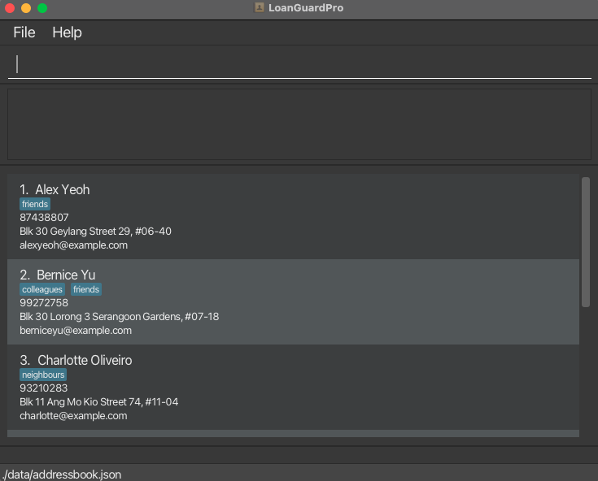
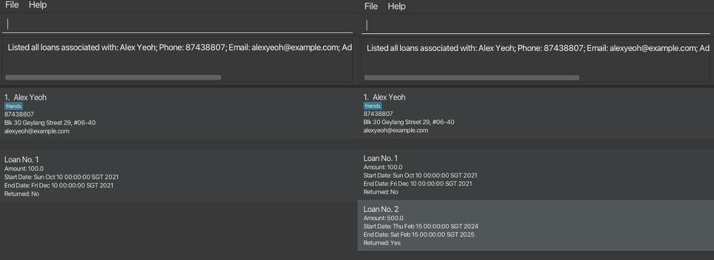
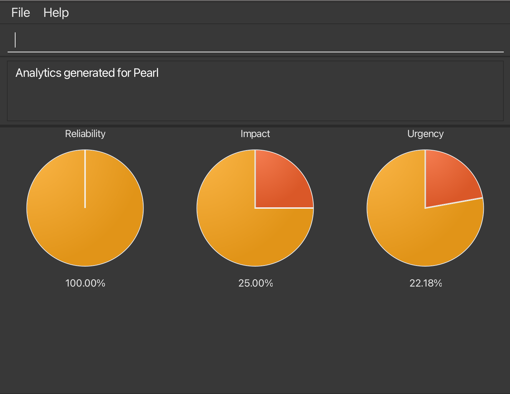

## Table of Contents

[1. Introduction](#introduction) 
[2. Quick Start](#quick-start) 
[3. Command Summary](#command-summary) 
[4. Features Description](#features-description) 

- [4.1 Contact Management Features](#contact-management-features) 
  - [Adding a person: `add`](#adding-a-person-add) 
  - [Listing all persons: `list`](#listing-all-persons--list) 
  - [Editing a person: `edit`](#editing-a-person--edit) 
  - [Locating persons by name: `find`](#locating-persons-by-name-find) 
  - [Deleting a person: `delete`](#deleting-a-person--delete) 
  - [Clearing all entries: `clear`](#clearing-all-entries--clear) 
- [4.2 Basic Loan Management Features](#basic-loan-management-features) 
  - [Adding a loan: `linkloan`](#adding-a-loan-linkloan) 
  - [Viewing loans of a person: `viewloan`](#viewing-loans-of-a-person-viewloan) 
  - [Mark/Unmark a loan as returned: `markloan/unmarkloan`](#markunmark-a-loan-as-returned-markloanunmarkloan) 
  - [Editing a loan: `editloan`](#editing-a-loan-editloan) 
  - [Deleting a loan: `deleteloan`](#deleting-a-loan-deleteloan) 
- [4.3 Advanced Loan Management Features](#advanced-loan-management-features) 
  - [Analysing a client's loan records: `analytics`](#analysing-a-clients-loan-records-analytics) 
- [4.4 Miscellaneous Features](#miscellaneous-features) 
  - [Viewing help: `help`](#viewing-help--help) 
  - [Exiting the program: `exit`](#exiting-the-program--exit) 
  - [Saving the data](#saving-the-data) 
  - [Editing the data file](#editing-the-data-file) 

[5. FAQ](#faq) 
[6. Known Issues](#known-issues) 

--------------------------------------------------------------------------------------------------------------------

## Introduction

LoanGuardPro is a desktop app for managing contacts, optimized for use via a Command Line Interface (CLI) while still
having the benefits of a Graphical User Interface (GUI).
If you are a moneylender looking to **keep track of your clients' contacts and loans**, LoanGuardPro is the right tool for you.

It is in the form of an address book and supports basic contact and loan handling features like adding, editing, deleting, and viewing contacts and loans.
More advanced features like analysing a client's loaning history are also available.

### How to Use this User Guide

* If you are new to Command Line Interfaces (CLI), go to
  this [website](https://www.theodinproject.com/lessons/foundations-command-line-basics) to learn the basics.
* If you are new to LoanGuardPro, go to the [Quick Start](#quick-start) section to download and set up the application.
* If you are looking for detailed explanations of contact management features, refer to
  the [Contact Management Features](#contact-management-features) section.
* If you are looking for detailed explanations of basic loan management features, refer to
  the [Basic Loan Management Features](#basic-loan-management-features) section.
* If you are looking for detailed explanations of advanced loan management features, refer to
  the [Advanced Loan Management Features](#advanced-loan-management-features) section.
* If you encounter any issues, refer to the [Known issues](#known-issues) section.

--------------------------------------------------------------------------------------------------------------------

## Quick start

1. Ensure you have Java `11` or above installed in your Computer.

1. Download the latest `loanguardpro.jar` from [here](https://github.com/AY2324S2-CS2103T-W13-1/tp/releases).

1. Copy the file to the folder you want to use as the _home folder_ for your LoanGuardPro.

1. Open a command terminal, `cd` into the folder you put the jar file in, and use the `java -jar loanguardpro.jar`
   command to run the application. 
   A GUI similar to the below should appear in a few seconds. Note how the app contains some sample data. 
   

1. Type the command in the command box and press Enter to execute it. e.g. typing **`help`** and pressing Enter will
   open the help window. 
   Some example commands you can try:

    * `viewloan 1` : View all active loans of the 1st person shown in the current list.
    * `linkloan 2 v/500.00 s/2024-02-15 r/2025-02-15` : Link a loan of $500.00 to the 2nd person shown in the current
      list with a start date of 15th Feb 2024 and repayment date of 15th Feb 2025.

    * `viewloan` : View all active loans.

1. Refer to the [Command Summary](#command-summary) section for details of the commands available.

<a href="#table-of-contents">Back to top</a>

--------------------------------------------------------------------------------------------------------------------

## Command summary

**:information_source: Notes about the command format:** 

* Words in `UPPER_CASE` are the parameters to be supplied by the user. 
  e.g. in `add n/NAME`, `NAME` is a parameter which can be used as `add n/John Doe`.

* Items in square brackets are optional. 
  e.g `n/NAME [t/TAG]` can be used as `n/John Doe t/friend` or as `n/John Doe`.

* Items with `…`​ after them can be used multiple times including zero times. 
  e.g. `[t/TAG]…​` can be used as ` ` (i.e. 0 times), `t/friend`, `t/friend t/family` etc.

* Parameters can be in any order. 
  e.g. if the command specifies `n/NAME p/PHONE_NUMBER`, `p/PHONE_NUMBER n/NAME` is also acceptable.

* Extraneous parameters for commands that do not take in parameters (such as `help`, `list`, `exit` and `clear`) will be
  ignored. 
  e.g. if the command specifies `help 123`, it will be interpreted as `help`.

* If you are using a PDF version of this document, be careful when copying and pasting commands that span multiple lines
  as space characters surrounding line-breaks may be omitted when copied over to the application.

There are three main categories of commands: Contact Management, Basic Loan Management, and Advanced Loan Management.

### Contact Management

| Action     | Format, Examples                                                                                                                                                      |
|------------|-----------------------------------------------------------------------------------------------------------------------------------------------------------------------|
| **Add**    | `add n/NAME p/PHONE_NUMBER e/EMAIL a/ADDRESS [t/TAG]…​`   e.g., `add n/James Ho p/22224444 e/jamesho@example.com a/123, Clementi Rd, 1234665 t/friend t/colleague` |
| **Clear**  | `clear`                                                                                                                                                               |
| **Delete** | `delete INDEX`  e.g., `delete 3`                                                                                                                                   |
| **Edit**   | `edit INDEX [n/NAME] [p/PHONE_NUMBER] [e/EMAIL] [a/ADDRESS] [t/TAG]…​`  e.g.,`edit 2 n/James Lee e/jameslee@example.com`                                           |
| **Find**   | `find KEYWORD [MORE_KEYWORDS]`  e.g., `find James Jake`                                                                                                            |
| **List**   | `list`                                                                                                                                                                |

### Basic Loan Management

| Action          | Format, Examples                                                                                                    |
|-----------------|---------------------------------------------------------------------------------------------------------------------|
| **Link Loan**   | `linkloan INDEX v/VALUE s/START_DATE r/RETURN_DATE`  e.g., `linkloan 1 v/500.00 s/2024-02-15 r/2025-02-15`       |
| **View Loan**   | `viewloan [FLAG] [INDEX]`  e.g., `viewloan 1`, `viewloan -a 1`                                                   |
| **Mark Loan**   | `markloan INDEX`  e.g., `markloan 1`                                                                             |
| **Unmark Loan** | `unmarkloan INDEX`  e.g., `unmarkloan 1`                                                                         |
| **Edit Loan**   | `editloan INDEX [v/VALUE] [s/START_DATE] [r/RETURN_DATE]`  e.g., `editloan 1 v/600.00 s/2024-02-15 r/2025-02-15` |
| **Delete Loan** | `deleteloan INDEX`  e.g., `deleteloan 1`                                                                         |

### Advanced Loan Management

| Action        | Format, Examples                          |
|---------------|-------------------------------------------|
| **Analytics** | `analytics INDEX`  e.g., `analytics 1` |

<a href="#table-of-contents">Back to top</a>

### Miscellaneous

| Action   | Format |
|----------|--------|
| **Exit** | `exit` |
| **Help** | `help` |

--------------------------------------------------------------------------------------------------------------------

## Features Description

This section provides a detailed description of the features available in LoanGuardPro. There are three main categories
of features:

* [Contact Management](#contact-management-features)
* [Basic Loan Management](#basic-loan-management-features)
* [Advanced Loan Management](#advanced-loan-management-features)

## Contact Management Features

### Adding a person: `add`

Adds a person to the address book.

Format: `add n/NAME p/PHONE_NUMBER e/EMAIL a/ADDRESS [t/TAG]…​`

:bulb: **Tip:**
A person can have any number of tags (including 0)

Parameters Restrictions:

* The name must only contain alphanumeric characters and spaces, and it should not be blank. The name is case-sensitive.
* The phone number must only contain numbers.
* The email must be in the format `local-part@domain`.

Expected Behaviour:

* A success message in the form of "New person added: [person details]" will be shown.
* The person will be added to the address book and will be shown in the person list.

Examples:

* `add n/John Doe p/98765432 e/johnd@example.com a/John street, block 123, #01-01`
* `add n/Betsy Crowe t/friend e/betsycrowe@example.com a/Newgate Prison p/1234567 t/criminal`

### Listing all persons : `list`

Shows a list of all persons in the address book.

Format: `list`

Expected Behaviour:

* A list of all persons in the address book will be shown.

### Editing a person : `edit`

Edits an existing person in the address book.

Format: `edit INDEX [n/NAME] [p/PHONE] [e/EMAIL] [a/ADDRESS] [t/TAG]…​`

Parameters Restrictions:

* At least one of the optional fields must be provided.
* The index **must be a positive integer** 1, 2, 3, …​, and it must not exceed the number of persons shown in the list.
* The name must only contain alphanumeric characters and spaces, and it should not be blank. The name is case-sensitive.
* The phone number must only contain numbers.
* The email must be in the format `local-part@domain`.

Expected Behaviour:

* Existing values will be updated to the input values.
* When editing tags, the existing tags of the person will be removed i.e adding of tags is not cumulative.
* You can remove all the person’s tags by typing `t/` without
  specifying any tags after it.
* A success message in the form of "Edited Person: [person details]" will be shown.
* The person will be updated in the address book and will be shown in the person list.

Examples:

* `edit 1 p/91234567 e/johndoe@example.com`
    * Edits the phone number and email address of the 1st person to be `91234567` and `johndoe@example.com`
      respectively.
* `edit 2 n/Betsy Crower t/`
    * Edits the name of the 2nd person to be `Betsy Crower` and clears all existing tags.

### Locating persons by name: `find`

Finds persons whose names contain any of the given keywords.

Format: `find KEYWORD [MORE_KEYWORDS]`

Parameters Restrictions:

* At least one keyword must be provided.
* The keywords are case-insensitive.
* The order of the keywords does not matter.

Expected Behaviour:

* Only the name is searched.
* Only full words will be matched e.g. `Han` will not match `Hans`
* Persons matching at least one keyword will be returned (i.e. `OR` search).
  e.g. `Hans Bo` will return `Hans Gruber`, `Bo Yang`
* A list of persons whose names contain the given keywords will be shown.
* See the example below for more concrete details.

Examples:

* `find John` returns `john` and `John Doe`
* `find alex david` returns `Alex Yeoh`, `David Li` 
  

### Deleting a person : `delete`

Deletes the specified person from the address book.

Format: `delete INDEX`

Parameters Restrictions:

* The index refers to the index number shown in the displayed person list.
* The index **must be a positive integer** 1, 2, 3, …​

Expected Behaviour:

* A success message in the form of "Deleted Person: [person details]" will be shown.
* The person will be removed from the address book and will no longer be shown in the person list.

Examples:

* `list` followed by `delete 2` deletes the 2nd person in the address book.
* `find Betsy` followed by `delete 1` deletes the 1st person in the results of the `find` command.

### Clearing all entries : `clear`

Clears all entries from the address book.

Format: `clear`

Expected Behaviour:

* A success message in the form of "Address book has been cleared!" will be shown.
* The address book will be empty.

<a href="#table-of-contents">Back to top</a>

--------------------------------------------------------------------------------------------------------------------

## Basic Loan Management Features

### Adding a loan: `linkloan`

Links a loan to a person in the address book.

:information_source: The word `linkloan` is used to distinguish between the `add` command for adding a person and
the `linkloan` command for linking a loan to a person.

Format: `linkloan INDEX v/VALUE s/START_DATE r/RETURN_DATE`

Parameters Restrictions:

* Links a loan to the person at the specified `INDEX`. The index refers to the index number shown in the displayed
  person list. The index **must be a positive integer** 1, 2, 3, …​, and it must not exceed the number of persons shown in the list.
* The loan value must be a positive float value that is **at most 2 decimal places**, as the app behavior may not be optimal for any higher precision.
* The start date and return date must be in the format `YYYY-MM-DD`.
* The return date must be after the start date.
* Year value has to be below 9999.

:bulb: **Tip:**
If you are on a view page with no person contacts, such as the "view all loans" page or the "analytics" page, you can use the `list` command to go back to the person list. That will allow you to use the `linkloan` command.

Expected Behaviour:

* A success message in the form of "New loan linked: [person name] [loan description]" will be shown.
* The loan can then be found in both the overall loan list and the loan list of that person.

Example: `linkloan 1 v/500.00 s/2024-02-15 r/2025-02-15`

* Links a loan of $500.00 to the person at the 1st index with a start date of 15th Feb 2024 and return date of 15th Feb
  2025.

### Viewing loans of a person: `viewloan`

Shows loans in the address book.

Format: `viewloan [FLAG] [INDEX]`

Parameters Restrictions:

* The optional index refers to the index number shown in the displayed person list. The index **must be a positive
  integer** 1, 2, 3, …​, and it must not exceed the number of persons shown in the list.
* If the optional index is not provided, all loans, across all clients in the list will be shown.
* The only optional flag is `-a` to show all loans including the inactive ones.

:bulb: **Tip:** A loan is considered active if the loan has not been marked as returned. Otherwise, it is considered inactive.

Expected Behaviour:

* A success message of the form "Listed all loans associated with [person details]." will be shown.
* The list is ordered by the end date of the loan.
* Only the active loans will be shown if the flag `-a` is not provided. If it is provided, both active and inactive loans will be shown.
* If the index is not provided, all loans across all clients in the list will be shown.
* If the index is provided, all loans of the person at the specified `INDEX` will be shown.

Examples: `viewloan 1`, `viewloan -a 1`

* The figure below shows an example of `viewloan 1`(left) and `viewloan -a 1`(right) being executed.

### Mark/Unmark a loan as returned: `markloan/unmarkloan`

Marks or unmarks a loan as returned.

Format: `markloan INDEX`, `unmarkloan INDEX`

Parameters Restrictions:
* The index refers to the index number shown in the displayed loan list. The index **must be a positive integer** 1, 2, 3, …​, and it must not exceed the number of loans shown in the list.

Expected Behaviour:
* A success message in the form of "Loan marked: [loan details]" or "Loan unmarked: [loan details]" will be shown.
* The status of the loan will be updated accordingly and will be reflected in the loan list.

Examples: `markloan 1`, `unmarkloan 1`

* Marks or unmarks the loan at that is in the 1st position in the loan list.

### Editing a loan: `editloan`

Edits an existing loan in the address book.

Format: `editloan INDEX [v/VALUE] [s/START_DATE] [r/RETURN_DATE]`

Parameters Restrictions:

* The index refers to the index number shown in the displayed loan list. The index **must be a positive integer** 1, 2, 3, …​, and it must not exceed the number of loans shown in the list.
* The loan value must be a positive float value that is **at most 2 decimal places**, as the app behavior may not be optimal for any higher precision.
* The start date and return date must be in the format `YYYY-MM-DD`.
* The return date must be after the start date.
* Year value has to be below 9999.
* The loan value, start date and return date are all optional parameters, but at least one of them must be provided.

Expected Behaviour:

* A success message in the form of "Loan edited: [loan details]" will be shown.
* The loan will be updated in the loan list.

Examples:

* `editloan 1 v/600.00 s/2024-02-15 r/2025-02-15`
    * Edits the loan at the 1st position in the loan list to have a value of $600.00, a start date of 15th Feb 2024, and a
  return date of 15th Feb 2025.
* `editloan 3 s/2021-01-01`
  * Edits the loan at the 3rd position in the loan list to have a start date of 1st Jan 2021.

### Deleting a loan: `deleteloan`

Deletes a loan permanently from the address book.

Format: `deleteloan INDEX`

Parameters Restrictions:

* The index refers to the index number shown in the displayed loan list.
The index **must be a positive integer** 1, 2, 3, …​, and it must not exceed the number of loans shown in the list.

Expected Behaviour:

* A success message in the form of "Loan deleted: [loan details]" will be shown.
* The loan will be removed from the loan list.

Example: `deleteloan 1`

* Deletes the loan at the 1st position in the loan list.

<a href="#table-of-contents">Back to top</a>

--------------------------------------------------------------------------------------------------------------------

## Advanced Loan Management Features

### Analysing a client's loan records: `analytics`

Provides visual analytics of a client's loan records based on three indices: Reliability, Impact, and Urgency.
* The Reliability index is defined as the ratio of overdue loans to the total number of loans.
* The Impact index is defined as the ratio of the average loan value to the maximum loan value.
* The Urgency index is defined as follows:
  * Define URGENCY_ALL as the number of days from the current date to the earliest return date among **all** active loans.
  * Define URGENCY_CLIENT as the number of days from the current date to the earliest return date among **this particular client's** active loans.
  * The Urgency index is equal to the ratio of URGENCY_ALL to URGENCY_CLIENT.
  * The computation will only consider loans that are not overdue.
* These indexes are then converted in percentage form and visualized in a pie chart.

Format: `analytics INDEX`

Parameters Restrictions:

* The index refers to the index number shown in the displayed person list. The index **must be a positive integer** 1, 2, 3, …​, and it must not exceed the number of persons shown in the list.

Expected Behaviour:

* A success message in the form of "Analytics generated for [person name]" will be shown.
* A visual representation of the client's loan records will be shown.

Example: `analytics 1`

--------------------------------------------------------------------------------------------------------------------

## Miscellaneous Features

### Viewing help : `help`

Shows a message explaining how to access the help page.

Format: `help`

### Exiting the program : `exit`

Exits the program.

Format: `exit`

### Saving the data

LoanGuardPro data are saved in the hard disk automatically after any command that changes the data. There is no need to
save manually.

### Editing the data file

LoanGuardPro data are saved automatically as a JSON file `[JAR file location]/data/addressbook.json`. Advanced users are
welcome to update data directly by editing that data file.

:exclamation: **Caution:**
If your changes to the data file makes its format invalid, LoanGuardPro **will discard all data and start with an empty
data file at the next run**. Hence, it is recommended to take a backup of the file before editing it. 
Furthermore, certain edits can cause the LoanGuardPro to behave in unexpected ways (e.g., if a value entered is outside
of the acceptable range). Therefore, edit the data file only if you are confident that you can update it correctly.

<a href="#table-of-contents">Back to top</a>

--------------------------------------------------------------------------------------------------------------------

## FAQ

**Q**: How do I transfer my data to another Computer? 
**A**: Install the app in the other computer and overwrite the empty data file it creates with the file that contains
the data of your previous LoanGuardPro home folder.

--------------------------------------------------------------------------------------------------------------------

## Known issues

1. **When using multiple screens**, if you move the application to a secondary screen, and later switch to using only
   the primary screen, the GUI will open off-screen. The remedy is to delete the `preferences.json` file created by the
   application before running the application again.

<a href="#table-of-contents">Back to top</a>

--------------------------------------------------------------------------------------------------------------------
